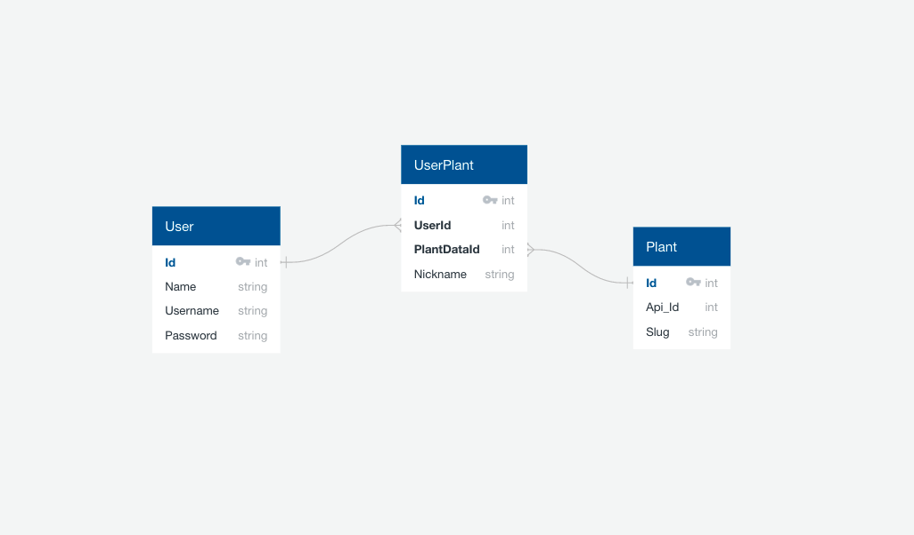
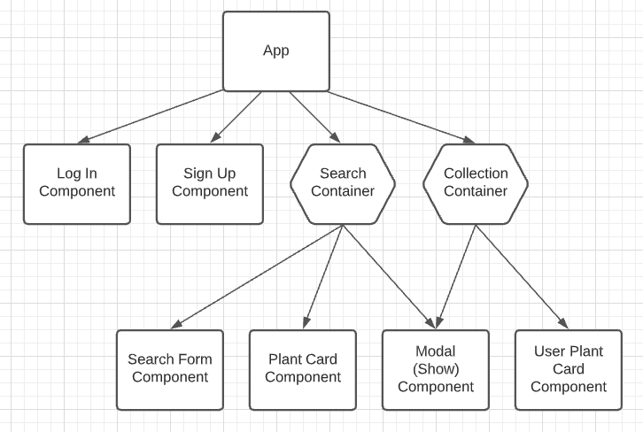
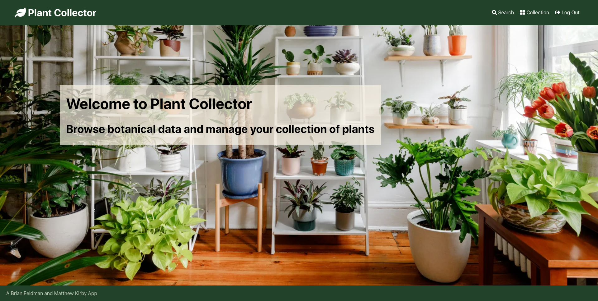
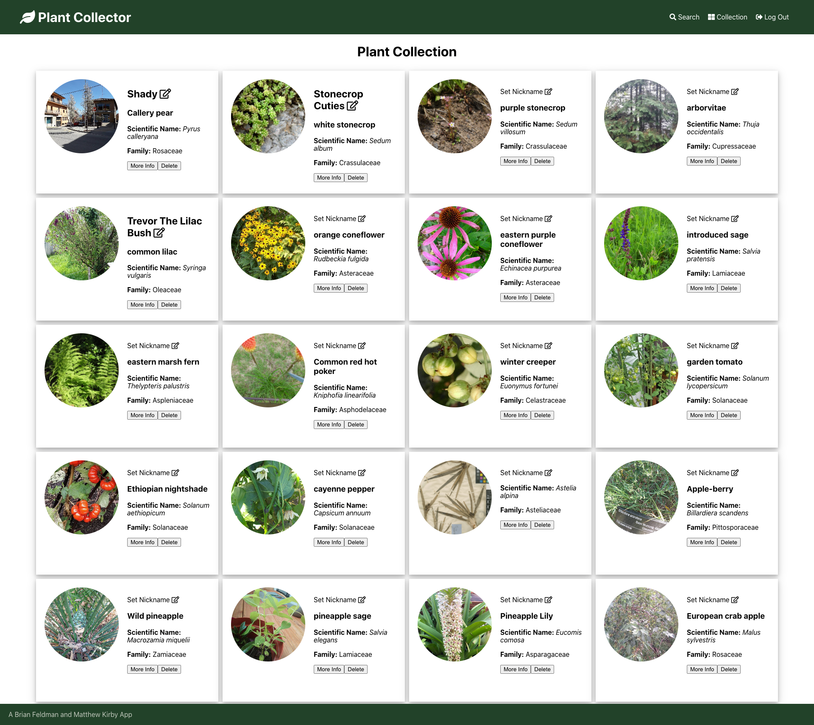
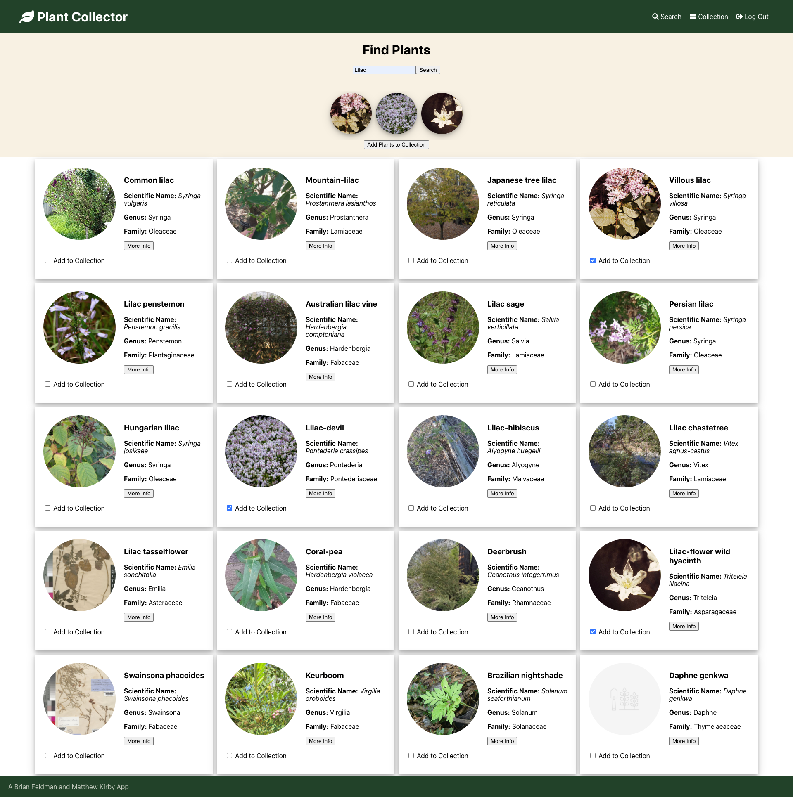
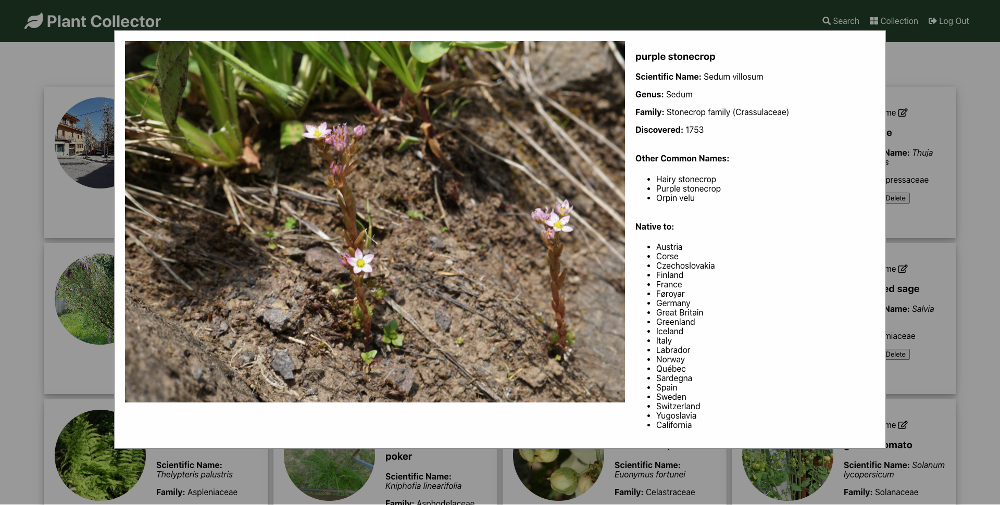

# PLANT APP README

A global plant management app for plant enthusiasts to view botanical data and manage their collection of plants.

- Dynamically pulled, searched, and rendered plant data from the Trefle API containing over 400 thousand plants.
- Programmed user interface employing React and CSS styling to add plants to a cart prior to a user’s collection.
- Utilized JSON Web Tokens and localStorage to store encrypted information client-side on login and registration.

### Ruby on Rails Backend: [Repo](https://github.com/mkirby/Plant-Project-BE)

### React Frontend: [Repo](https://github.com/mkirby/Plant-Project-FE)

### Seed Data

- [Trefle.io](trefle.io/) - A global plants API

### Packages

- [Active Model Serializers](https://github.com/rails-api/active_model_serializers)
- [jwt](https://github.com/jwt/ruby-jwt)
- [faker](https://github.com/faker-ruby/faker)
- [figaro](https://github.com/laserlemon/figaro)
- [rest-client](https://github.com/rest-client/rest-client)

## Domain Model

## Component Hierarchy

## Home Page

## Collection Page

## Search Page

## Botanical Data Modal

A Brian Feldman and Matthew Kirby app
